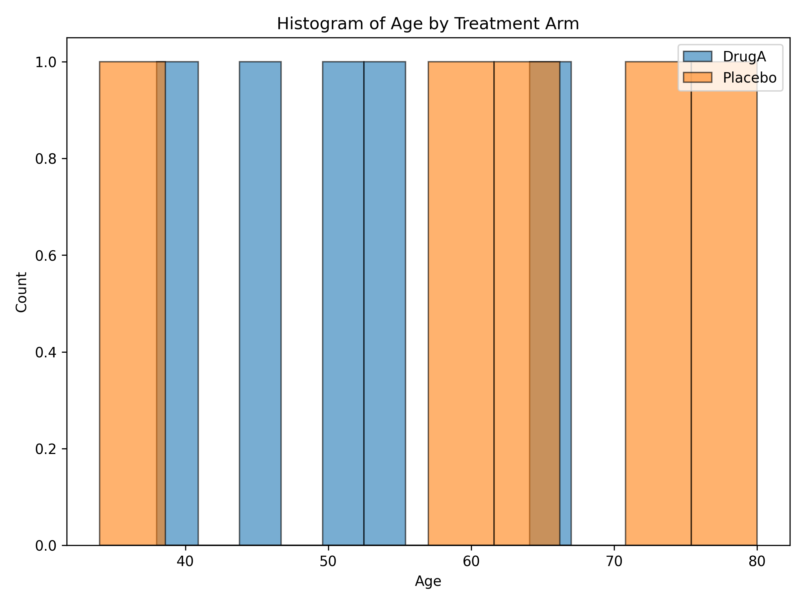

# QC TLF Python Project

---

## Project Overview
- Goal: Generate deterministic, reproducible QC Tables, Listings, and Figures (TLFs) from CDISC SDTM and ADaM datasets for independent verification against SAS-generated TLFs.
- Context: Used for cell-by-cell comparison in clinical trial programming QC, not for regulatory submission.

---

## Key Requirements
- Input: SDTM and ADaM datasets (CSV/XPT)
- Output: QC TLFs (CSV, Excel, PNG)
- Logic: Strictly follows Statistical Analysis Plan (SAP) and SAS TLFs
- Tools: pandas, numpy, matplotlib (no seaborn)
- Determinism: No randomization; reproducible results
- Documentation: Explicit dataset/variable names, population flags, analysis parameters, grouping, ordering
- SAS Matching: Handles missing values, sorting, rounding, decimal precision

---

## Project Structure
1. Load Data
2. Apply Population Filters
3. Apply Derivation Logic
4. Generate TLFs
5. Export Output
6. Generate Listings

---

## Sample Code (Python)
```python
import pandas as pd
import numpy as np
import matplotlib.pyplot as plt
# ...existing code...
```
- Modular, well-documented, and SAP/SAS-aligned

---


## Sample Outputs
  Link: https://github.com/justin-mbca/QC-TLF-Python-Verification/blob/main/qc_outputs/table1_age_by_treatment.csv
  Link: https://github.com/justin-mbca/QC-TLF-Python-Verification/blob/main/qc_outputs/listing1_subject_safety.csv
  Link: https://github.com/justin-mbca/QC-TLF-Python-Verification/blob/main/qc_outputs/figure1_age_histogram.png

---

## TLF Output: Table 1 - Age by Treatment

| TRT01A   | N | Mean | SD   | Min | Max |
|----------|---|------|------|-----|-----|
| DrugA    | 5 | 51.4 | 10.9 | 38  | 67  |
| Placebo  | 5 | 61.8 | 17.4 | 34  | 80  |

---

## TLF Output: Listing 1 - Subject Safety

<!-- size: 80% -->
| USUBJID | AGE | SEX | RACE   | TRT01A  | SAFFL | ITTFL | PPSFL |
|---------|-----|-----|--------|---------|-------|-------|-------|
| 1001    | 34  | M   | White  | Placebo | Y     | Y     | Y     |
| 1002    | 67  | F   | Asian  | DrugA   | Y     | Y     | N     |
| 1003    | 55  | F   | Black  | DrugA   | Y     | N     | Y     |
| 1004    | 72  | M   | White  | Placebo | Y     | Y     | Y     |
| 1005    | 45  | F   | Asian  | DrugA   | Y     | Y     | Y     |

---

<!-- size: 80% -->
## TLF Output: Listing 1 - Subject Safety (cont.)
| USUBJID | AGE | SEX | RACE   | TRT01A  | SAFFL | ITTFL | PPSFL |
|---------|-----|-----|--------|---------|-------|-------|-------|
| 1006    | 60  | M   | Black  | Placebo | Y     | N     | Y     |
| 1007    | 38  | F   | White  | DrugA   | Y     | Y     | Y     |
| 1008    | 80  | M   | Asian  | Placebo | Y     | Y     | N     |
| 1009    | 52  | F   | Black  | DrugA   | Y     | Y     | Y     |
| 1010    | 63  | M   | White  | Placebo | Y     | Y     | Y     |

---

## TLF Output: Figure 1 - Age Histogram



---

---

## Testing & Validation
- Created sample CSV files for ADaM and SDTM
- Ran script to generate QC outputs
- Verified outputs for cell-by-cell comparison with SAS

---

## Prompt Used for Code Generation & ChatGPT Enterprise
- Prompt Example:
  > Generate deterministic, reproducible Python code to create QC Tables, Listings, and Figures (TLFs) from CDISC SDTM and ADaM datasets for independent verification against SAS-generated TLFs. Follow SAP and SAS logic, use pandas/numpy/matplotlib, document dataset/variable names, population flags, analysis parameters, grouping, ordering, and match SAS behavior for missing values, sorting, rounding, and decimal precision. Structure code into clear sections: Load data, Apply population filters, Apply derivation logic, Generate TLF, Export output. Output numeric values for cell-by-cell comparison.
- ChatGPT Enterprise Use:
  - Used ChatGPT Enterprise to generate, review, and validate Python code for QC TLFs.
  - Compared Python-generated outputs against SAS TLFs for cell-by-cell QC.
  - Leveraged AI for rapid prototyping, documentation, and deterministic logic.
  - Ensured strict adherence to SAP and SAS requirements.

---

## How ChatGPT Enterprise Supports Validation
- Code Review: Reviews Python and SAS code for logic, structure, and SAP/SAS alignment.
- Logic Comparison: Compares Python and SAS TLF generation logic for equivalence.
- Output Validation: Assists in cell-by-cell comparison of Python and SAS outputs (CSV, Excel, PNG).
- Documentation & Transparency: Generates clear documentation for QC workflow, code, and validation steps.
- Rapid Prototyping: Quickly generates and tests new QC logic or TLFs for SAP changes.

---

## Interview Talking Points
- Demonstrated end-to-end QC TLF workflow in Python
- Matched SAS logic for clinical trial QC
- Automated, reproducible, and transparent process
- Used ChatGPT Enterprise for code generation and QC
- Ready for extension to additional TLFs or listings

---


---


## Calling SAS from Python for Integrated QC

- **Why?**
  - Automate running SAS scripts and comparing outputs directly from Python.
  - Streamline cell-by-cell QC between Python and SAS TLFs.

- **Practical Options:**
  1. **Local SAS executable (Windows/Linux):**
     - Use Python’s subprocess module:
       ```python
       import subprocess
       subprocess.run(['sas', 'your_script.sas'], check=True)
       ```
     - Requires SAS installed locally.

  2. **Remote SAS server (any OS):**
     - Use SASPy to connect from Python:
       ```python
       import saspy
       sas = saspy.SASsession()
       sas.submit("proc print data=yourdata; run;")
       ```
     - Requires access to a SAS server (on-prem or cloud).

  3. **SAS Viya (cloud):**
     - Use SASPy or REST APIs for integration.
     - Supports modern Python/SAS workflows.

  4. **SAS OnDemand for Academics (cloud):**
     - Run SAS scripts in browser, export outputs for comparison.
     - Cannot call directly from Python, but can automate downloads.

- **Documentation:**
  - Add sample scripts and instructions in repo for reproducible QC.

---

## Next Steps

---

## Placeholder: Live SAS Server Integration

Suppose we have access to a SAS server (on-prem or cloud), we can:
- Run SAS scripts directly from Python using saspy or REST APIs
- Generate TLF outputs in real time
- Compare Python and SAS outputs automatically (cell-by-cell, listings, figures)
- Update this slide deck with live results and comparison metrics

This enables fully automated, reproducible QC workflows and seamless integration between Python and SAS.

---


- Add `marp: true` in front-matter
- Write slides in Markdown
- Preview and export to PPTX/PDF in VS Code

---

## Thank You!
Questions?
